# 🛡️ NFCC Digital Twin
### *Nusantara Fortified Command Complex — Digital Twin, Automation & Integrated Emergency Management System*

[](https://www.typescriptlang.org/)
[](https://react.dev/)
[](https://threejs.org/)
[](https://vitejs.dev/)
[](LICENSE)

---

## 📸 Screenshots

### Main Dashboard — 3D Holographic View
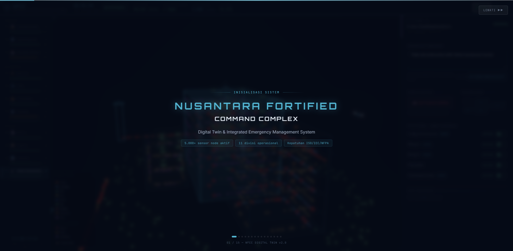

---

### Division Dashboards

#### Division 01 — Komando Utama
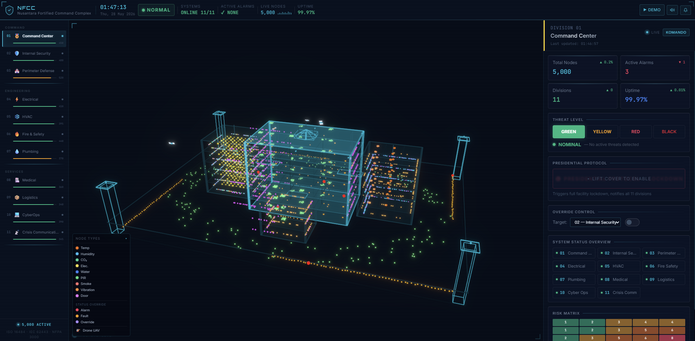

#### Division 02 — Keamanan Dalam
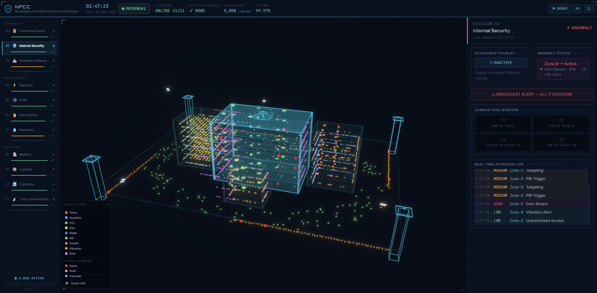

#### Division 03 — Pertahanan Perimeter
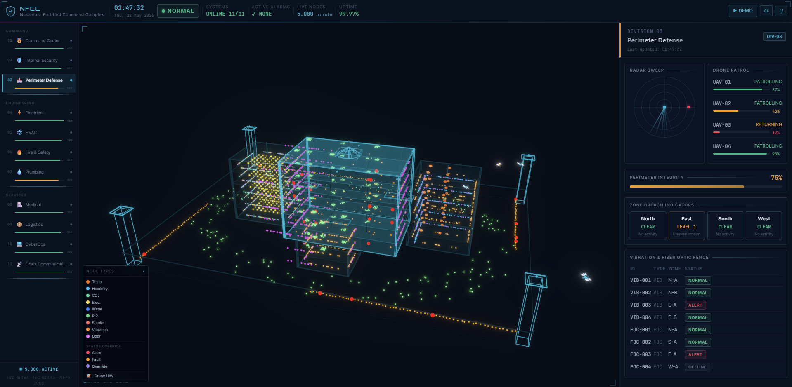

#### Division 04 — Ketenagalistrikan
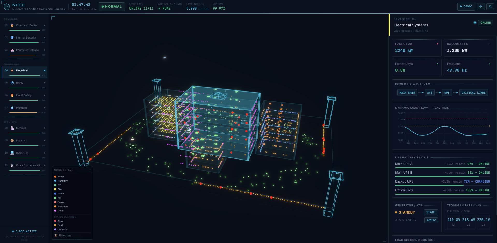

#### Division 05 — HVAC & Mekanikal
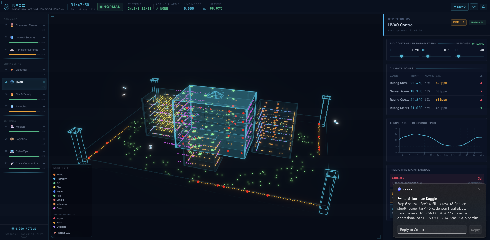

#### Division 06 — Keselamatan Kebakaran
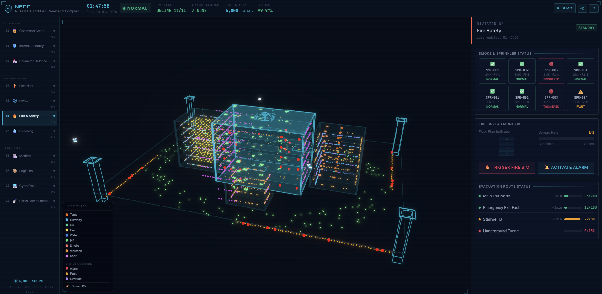

#### Division 07 — Plumbing & Sanitasi
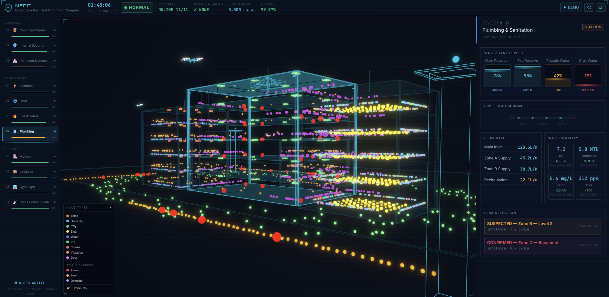

#### Division 08 — Layanan Medis
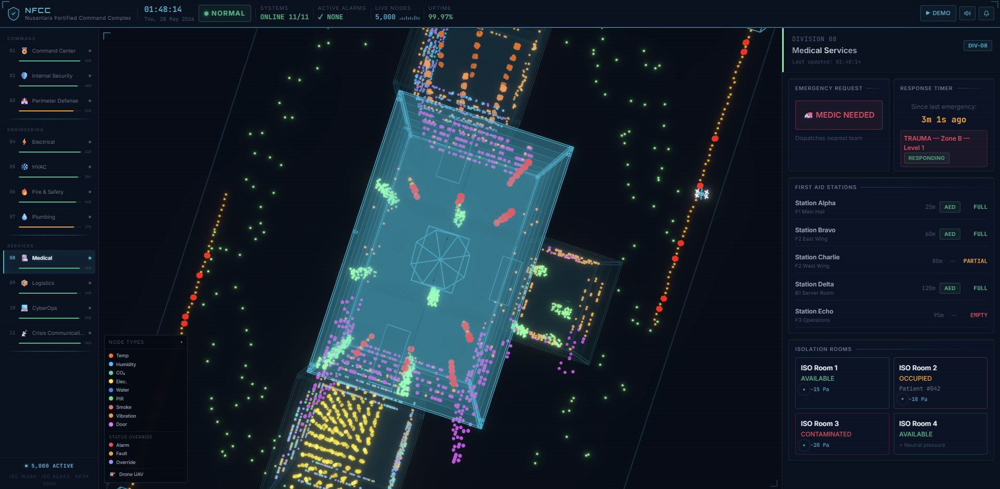

#### Division 09 — Logistik & Operasional
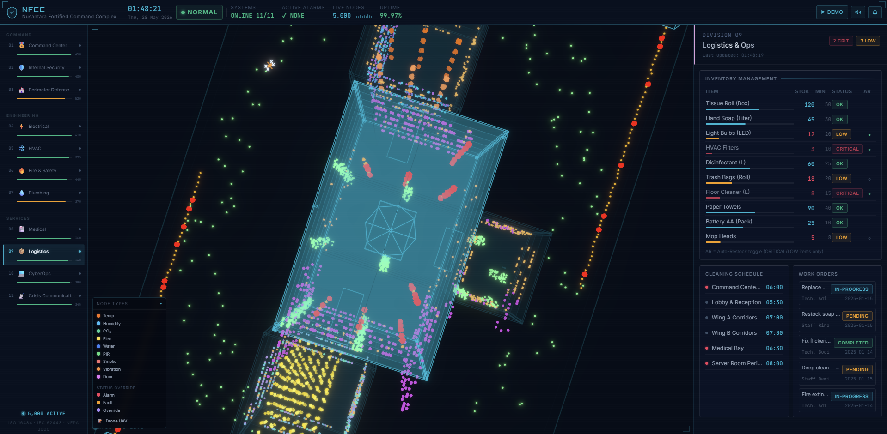

#### Division 10 — Operasi Siber
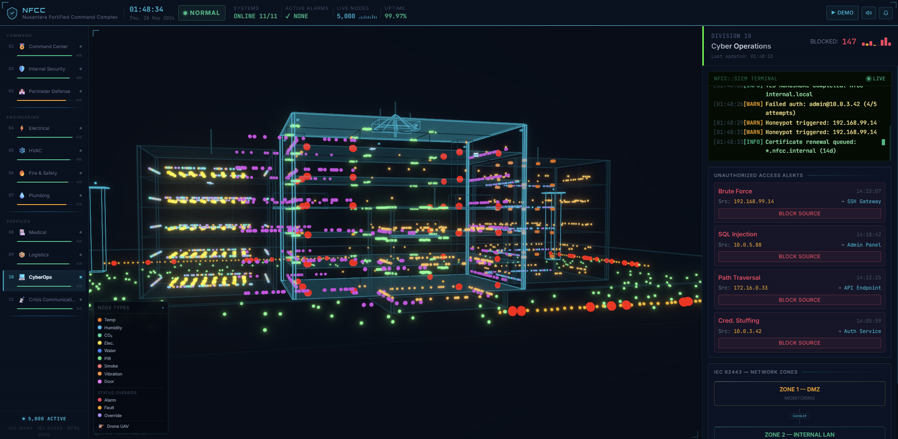

#### Division 11 — Komunikasi Krisis
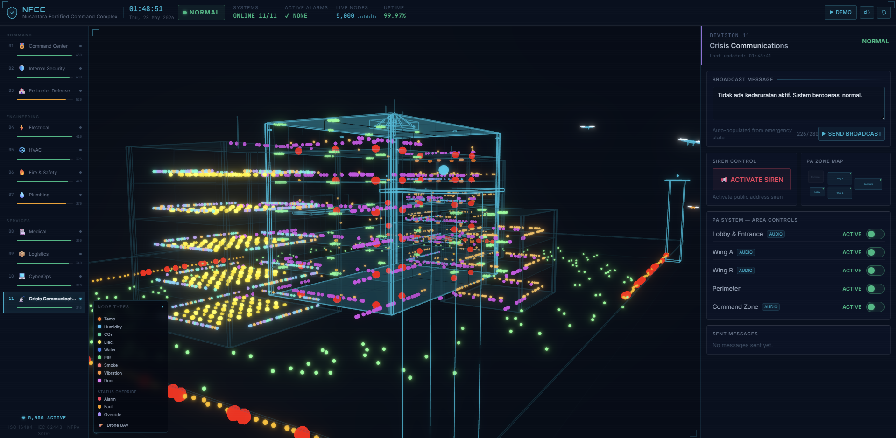

---

## Overview

A fully **client-side Digital Twin Command Center** simulating a national critical infrastructure complex with **5,000+ real-time sensor nodes** across **11 operational divisions**. Zero backend — everything runs in the browser using Web Workers, WebGL, and IndexedDB.

---

## ✨ Key Features

### 🏗️ 3D Holographic Visualization
- **X-ray building** — EdgesGeometry with semi-transparent glass walls, visible floor partitions and room layouts
- **5,000 sensor nodes** color-coded by sensor type with architecturally correct placement:
  - Door contacts → wall edges at door-frame height
  - PIR motion → ceiling corners
  - Smoke/heat detectors → ceiling center spans
  - Electrical panels → clustered in panel rooms
  - Vibration sensors → along fence perimeter
- **Hover tooltip** — hover any node to see full BIM metadata (vendor, install date, ISO reference, criticality, live value)
- **4 UAV drones** with independent Lissajous flight paths, dynamic yaw orientation
- Bloom post-processing for neon glow hologram aesthetic

### 📊 11 Division Dashboards

| # | Division | Key Features |
|---|---------|-------------|
| 01 | Komando Utama | Threat gauge, Presidential Protocol (safety cover), Risk Matrix 5×5 |
| 02 | Keamanan Dalam | K-Means AI heatmap, real-time intrusion log, mass notification |
| 03 | Pertahanan Perimeter | Phosphor afterglow radar, drone patrol status, zone breach indicators |
| 04 | Ketenagalistrikan | PLN 220V/50Hz live load flow, UPS runtime estimate, power flow diagram |
| 05 | HVAC | PID controller tuning, tropical climate zones (22-24°C), predictive maintenance |
| 06 | Keselamatan Kebakaran | Fire spread monitor, floor plan indicator, A* evacuation routes |
| 07 | Plumbing & Sanitasi | Animated tank levels, pipe flow diagram, Permenkes 492 water quality |
| 08 | Layanan Medis | Response timer, isolation room pressure monitor, first aid map |
| 09 | Logistik & Operasional | Inventory with stock bars, auto-restock toggle, work orders |
| 10 | Operasi Siber | SIEM terminal with blinking cursor, IEC 62443 network zones, threat sparkline |
| 11 | Komunikasi Krisis | Auto-draft broadcast, PA zone SVG map, siren control, delivery status |

### 🚨 Emergency Management
- **State machine**: NORMAL ↔ LOCKDOWN, NORMAL ↔ EVACUATION, LOCKDOWN → EVACUATION
- Door lockdown, Web Audio alarm tones, red border overlay
- A* pathfinding evacuation routes
- Coordinates across all 11 divisions simultaneously

### 🎬 Cinematic Demo Mode
- **14-scene** automated walkthrough with Indonesian narration
- Camera auto-focuses on each division's zone in the 3D building
- Progress indicator with scene dots
- Press **▶ DEMO** or navigate to `?mode=demo`

### 🔔 Notification System
- Click bell icon → dropdown panel with full notification history
- Type badges (INFO/WARNING/CRITICAL), division name, relative + absolute timestamp
- Dismiss individual or clear all

---

## 🏛️ Architecture

```
Browser
├── Main Thread
│   ├── React 18 UI (Zustand state — UI only)
│   ├── Three.js / React Three Fiber (3D scene, InstancedMesh)
│   └── Web Audio API (alarm tones — no external files)
│
├── BrokerWorker     — topic-based pub/sub event bus
├── PhysicsWorker    — 500ms simulation tick
│   ├── Newton's Law of Cooling (tropical ambient 30°C)
│   ├── PLN 220V/50Hz electrical load simulation
│   ├── Water tank mass balance (Permenkes 492)
│   └── Seismic random walk
├── AIWorker         — K-Means clustering + A* pathfinding
│
└── IndexedDB        — time-series historian (Dexie.js, 24h retention)
```

### Technology Stack

| Layer | Technology |
|-------|-----------|
| Framework | React 18 + TypeScript (strict mode, zero `any`) |
| 3D Rendering | Three.js + @react-three/fiber + @react-three/drei |
| Post-processing | @react-three/postprocessing (Bloom) |
| State Management | Zustand |
| Charts | Recharts |
| Animations | GSAP + Framer Motion |
| Styling | Tailwind CSS |
| Fonts | Orbitron (brand) · JetBrains Mono (data) · Inter (UI) |
| Data Storage | Dexie.js (IndexedDB) |
| Build Tool | Vite |
| Testing | Vitest + fast-check (property-based, 13 properties) |

---

## 📋 Standards Compliance

| Standard | Implementation |
|----------|---------------|
| **ISO 16484-5** (BACS) | BACnet property structure for all 5,000 sensor nodes |
| **ISO 52120-1** | Energy efficiency BAC functions, HVAC demand control |
| **IEC 62443-3-3** | Network zone & conduit model (CyberOps Division) |
| **ISO 27001** | Access log, audit trail, anomaly detection |
| **NFPA 3000** (ASHER) | Active shooter/hazard protocol — lockdown, mass notification |
| **NFPA 72** | Fire alarm system simulation |
| **ISO 19650** | BIM metadata per sensor node (vendor, install date, criticality) |
| **ISO 31000** | Risk matrix 5×5 in Command Center |
| **ISO 22301** | Business continuity — failover, emergency restore |
| **Permenkes No.492/2010** | Indonesian drinking water quality parameters |
| **SNI 01-3553-2006** | Indonesian water quality standard |
| **PLN SPLN D3.002** | 220V/50Hz electrical specification |

---

## 🚀 Getting Started

```bash
# Clone
git clone https://github.com/athifatharmn06/nfcc-digital-twin.git
cd nfcc-digital-twin

# Install dependencies
npm install

# Run development server
npm run dev
# → http://localhost:5173

# Build for production
npm run build

# Run tests (property-based + unit)
npm test
```

### Demo Mode
```
http://localhost:5173?mode=demo
```
Or click **▶ DEMO** in the header.

---

## 📁 Project Structure

```
src/
├── three/                    # 3D scene components
│   ├── HologramBuilding.tsx  # X-ray building (EdgesGeometry)
│   ├── SensorNodes.tsx       # InstancedMesh 5000 nodes
│   ├── DronePatrol.tsx       # 4 UAV drones (Lissajous paths)
│   ├── NodeTooltip.tsx       # BIM metadata hover popup
│   ├── NodeLegend.tsx        # Sensor type color legend
│   ├── NFCCScene.tsx         # Canvas + Bloom
│   └── CameraController.tsx  # OrbitControls + programmatic transitions
│
├── core/
│   ├── workers/
│   │   ├── broker.worker.ts  # Pub/sub event bus
│   │   ├── physics.worker.ts # Simulation engine (PLN 220V, tropical HVAC)
│   │   └── ai.worker.ts      # K-Means + A* pathfinding
│   ├── store/
│   │   ├── useNFCCStore.ts   # Zustand store (UI state only)
│   │   ├── emergencyMachine.ts
│   │   └── historian.ts      # IndexedDB time-series
│   └── types/index.ts        # All TypeScript interfaces
│
├── components/
│   ├── divisions/            # 11 division dashboards
│   ├── layout/               # AppLayout, HeaderBar, DivisionSidebar
│   ├── demo/                 # DemoController, NexusDemoOverlay
│   └── ui/                   # ComplianceMatrix, NotificationPanel
│
└── utils/
    └── audio.ts              # Web Audio API alarm tones
```

---

## 👨‍💻 Author

**Athif Fadheel**  
Electrical Engineering Student

*Built to demonstrate advanced programming capabilities through a mission-critical national infrastructure simulation — integrating systems engineering, real-time simulation, 3D visualization, AI/ML algorithms, and international standards compliance.*

---

*NFCC Digital Twin — Zero backend. All computation in the browser.*
